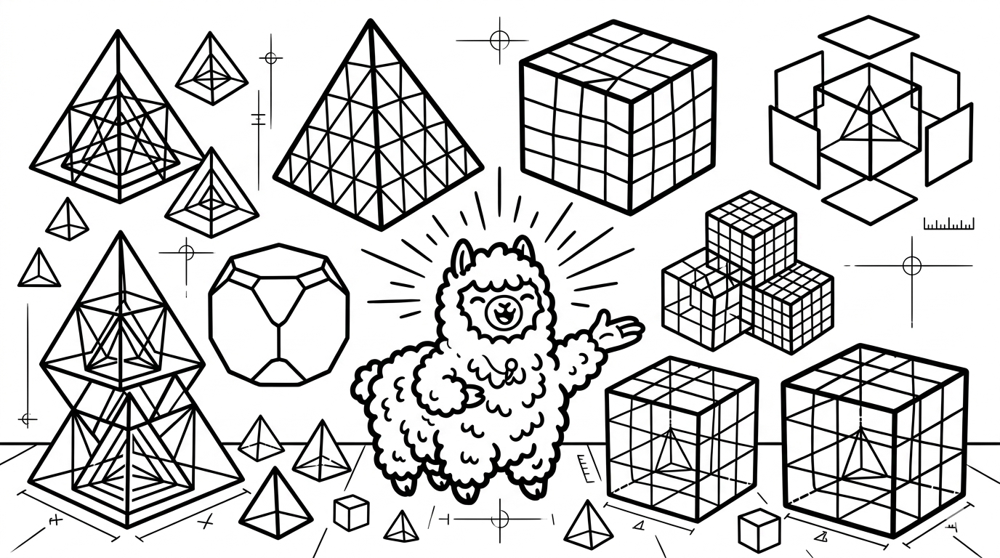

# Elements

Llama supports the following CalculiX solid element types:

## Tetrahedral Elements

| Element  | Nodes | Description                        |
| -------- | ----- | ---------------------------------- |
| Tetra4   | 4     | Linear tetrahedron                 |
| Tetra10  | 10    | Quadratic tetrahedron              |

Tetrahedral elements are generated automatically by the **Gmsh Tetra Mesh** component. Use linear (4-node) elements for fast preliminary analyses and quadratic (10-node) elements for higher accuracy.

## Hexahedral Elements

| Element  | Nodes | Description                        |
| -------- | ----- | ---------------------------------- |
| Hexa20   | 20    | Quadratic hexahedron (brick)       |

Hexahedral meshes can be imported from external tools and converted using the **Hex Mesh to Model** component.
