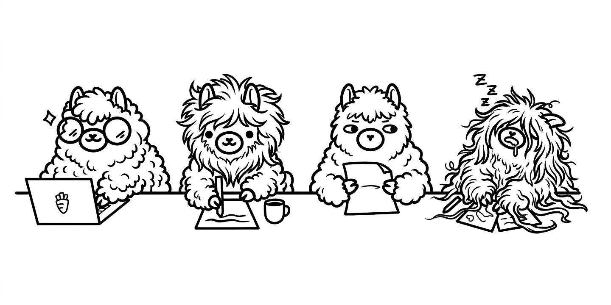

# Welcome

Llama is a Grasshopper plugin for finite element analysis using [CalculiX](http://www.calculix.de/).
It lets you model, mesh, and analyse structures with beam, shell, and solid elements — all within a parametric Grasshopper workflow.

Llama is developed by [Marco Pellegrino](https://www.linkedin.com/in/mp0110/).

## Features

- **Meshing** – Generate tetrahedral meshes via Gmsh directly in Grasshopper
- **Materials** – Isotropic, orthotropic, spring, and stiffness matrix materials
- **Elements** – Tetra, hexa, and shell elements
- **Analysis** – Linear static, nonlinear static, dynamic implicit, and frequency steps
- **Post-processing** – Read CalculiX results and visualise deformed shapes and stresses

## Getting started

Head to [Installation](installation.md) to set up Llama, then explore the [Basics](basics/materials.md) to learn how each component works.

!!! note
    The author cannot be held responsible for the output. Results should
    always be validated against another finite element analysis package.
